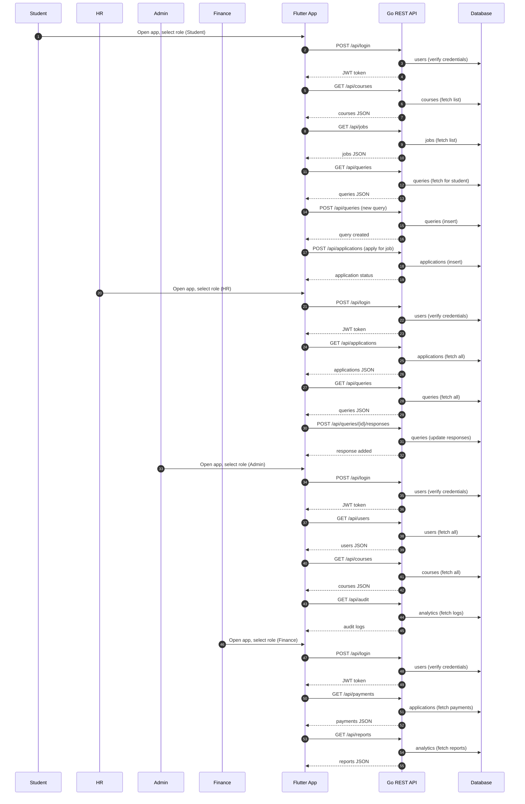
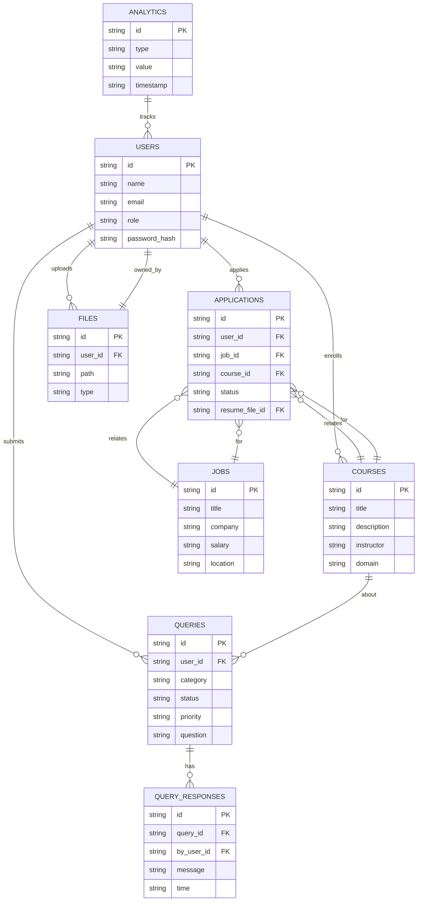

# Application Architecture & Flow Diagram

This document provides a high-level overview of the Student PM App, including all user roles, Flutter screens, API endpoints (Go backend), and database tables.

## Mermaid Flow Diagram

```mermaid
flowchart TD
  subgraph Users
    Student["Student"]
    HR["HR"]
    Admin["Admin"]
    Finance["Finance"]
  end

  subgraph FlutterApp["Flutter App (Frontend)"]
    Login["Login/Role Selection"]
    StudentDash["Student Dashboard"]
    HRDash["HR Dashboard"]
    AdminDash["Admin Dashboard"]
    FinanceDash["Finance Dashboard"]
    Profile["Profile Management"]
    Courses["Course Catalog & Enrollment"]
    MyCourses["My Courses"]
    Jobs["Job Listings & Applications"]
    MyJobs["My Applications"]
    Queries["Query Portal"]
    QueryDetail["Query Detail/Thread"]
    Settings["Settings/Theme"]
  end

  subgraph API["Go REST API"]
    AuthAPI["/api/login, /api/register"]
    StudentAPI["/api/students"]
    CourseAPI["/api/courses"]
    JobAPI["/api/jobs, /api/applications"]
    QueryAPI["/api/queries"]
    AnalyticsAPI["/api/analytics"]
    FileAPI["/api/files"]
  end

  subgraph DB["Database (Postgres/MySQL)"]
    StudentsTable["students"]
    CoursesTable["courses"]
    JobsTable["jobs"]
    ApplicationsTable["applications"]
    QueriesTable["queries"]
    UsersTable["users"]
    FilesTable["files"]
    AnalyticsTable["analytics"]
  end

  Student --> Login
  HR --> Login
  Admin --> Login
  Finance --> Login

  Login -->|"POST /api/login"| AuthAPI
  StudentDash -->|"GET /api/courses"| CourseAPI
  StudentDash -->|"GET /api/jobs"| JobAPI
  StudentDash -->|"GET /api/queries"| QueryAPI
  HRDash -->|"GET /api/applications"| JobAPI
  HRDash -->|"GET /api/queries"| QueryAPI
  HRDash -->|"GET /api/analytics"| AnalyticsAPI
  AdminDash -->|"GET /api/users"| StudentAPI
  AdminDash -->|"GET /api/courses"| CourseAPI
  AdminDash -->|"GET /api/audit"| AnalyticsAPI
  FinanceDash -->|"GET /api/payments"| AnalyticsAPI
  FinanceDash -->|"GET /api/reports"| AnalyticsAPI
  Profile -->|"GET/PUT /api/students/{id}"| StudentAPI
  Courses -->|"GET /api/courses"| CourseAPI
  MyCourses -->|"GET /api/courses/enrolled"| CourseAPI
  Jobs -->|"GET /api/jobs"| JobAPI
  MyJobs -->|"GET /api/applications"| JobAPI
  Queries -->|"GET/POST /api/queries"| QueryAPI
  QueryDetail -->|"GET/POST /api/queries/{id}/responses"| QueryAPI
  Settings -->|"GET/PUT /api/users/{id}/settings"| AuthAPI

  AuthAPI --> UsersTable
  StudentAPI --> StudentsTable
  CourseAPI --> CoursesTable
  JobAPI --> JobsTable
  JobAPI --> ApplicationsTable
  QueryAPI --> QueriesTable
  AnalyticsAPI --> AnalyticsTable
  FileAPI --> FilesTable
```

## Explanation
- **Users**: Four roles (Student, HR, Admin, Finance) each have their own dashboard and features.
- **Flutter App**: Each screen corresponds to a major feature/module.
- **API**: Go REST API exposes endpoints for all resources, with role-based access control.
- **Database**: Each API endpoint maps to one or more tables in a relational database.

This diagram serves as a blueprint for backend integration and future expansion. 

## Detailed Flow & Sequence Diagram

## Database ER Diagram

---

This expanded documentation provides a clear, detailed flow and database structure for backend/API implementation and future scaling. 